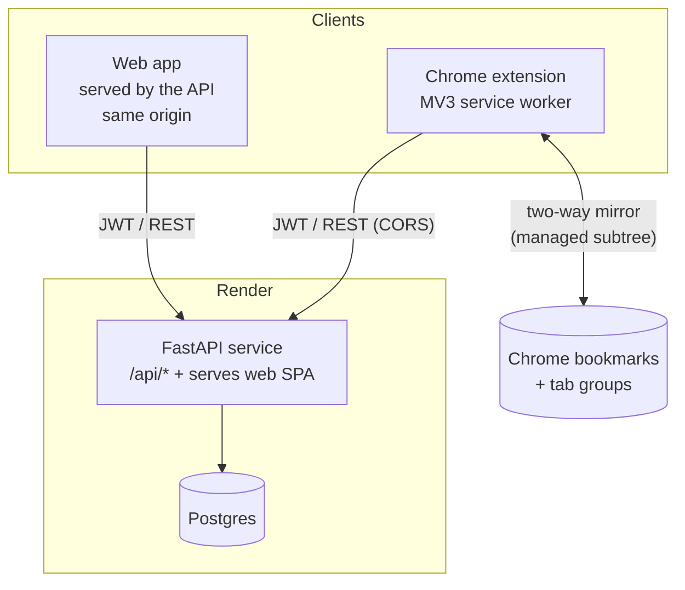

# Architecture

Three clients, one API, one database. Everything is per-user; sync converges via a per-user revision clock.

## Components

**Backend (`backend/`)** — FastAPI + synchronous SQLAlchemy + Postgres.
- `/api/auth/*` — signup, login, refresh (rotating), logout, me.
- `/api/sync` — `GET ?since_rev=N` (pull) and `POST` (push). This is the only data path clients need; both items and tab-sessions flow through it.
- Serves the web SPA as static files for all non-`/api` routes, so web app and API share one origin (no CORS for the web app; the extension is cross-origin and allow-listed via `CORS_ORIGINS`).

**Web app (`web/`)** — the Signal Desk UI. Same buckets/review/playbook as the standalone version, but its data layer is a `SyncClient` (talks to `/api/sync`) backed by an IndexedDB cache for offline use, gated behind login/signup. Adds a **Sessions** view for tab groups.

**Extension (`extension/`)** — MV3. A service worker runs the entity-sync loop on an alarm and reacts to bookmark events. Three jobs:
1. **Quick-capture** the current tab into a bucket (popup).
2. **Tab sessions** ("Groups"): save the current window's tabs (with tab-group titles/colors) and restore them later.
3. **Two-way bookmark sync**: mirror items ↔ a managed Chrome bookmark subtree (`docs/EXTENSION.md`).

## Data flow (one edit, three devices)
1. Device A edits an item → local write (`updated_at = now`, `_dirty`).
2. A's next sync `POST`s the dirty row → server applies **last-write-wins**, bumps the user's `rev`, returns the canonical row.
3. Devices B and C `GET /api/sync?since_rev=<their last>` → receive the change (rev-ordered), overwrite their local copy.
4. On the extension, the changed item is also reflected into Chrome bookmarks (Direction A in `docs/EXTENSION.md`).

## Why this shape
- **One sync endpoint + a per-user `rev`** keeps clients trivially correct: "give me everything since N," apply, done. No per-field merge, no server push infra.
- **Client-generated UUIDs + tombstones** make offline creation and deletion safe.
- **Serving the SPA from the API** removes a whole class of CORS/cookie headaches for the common (web) case; only the extension needs CORS.
